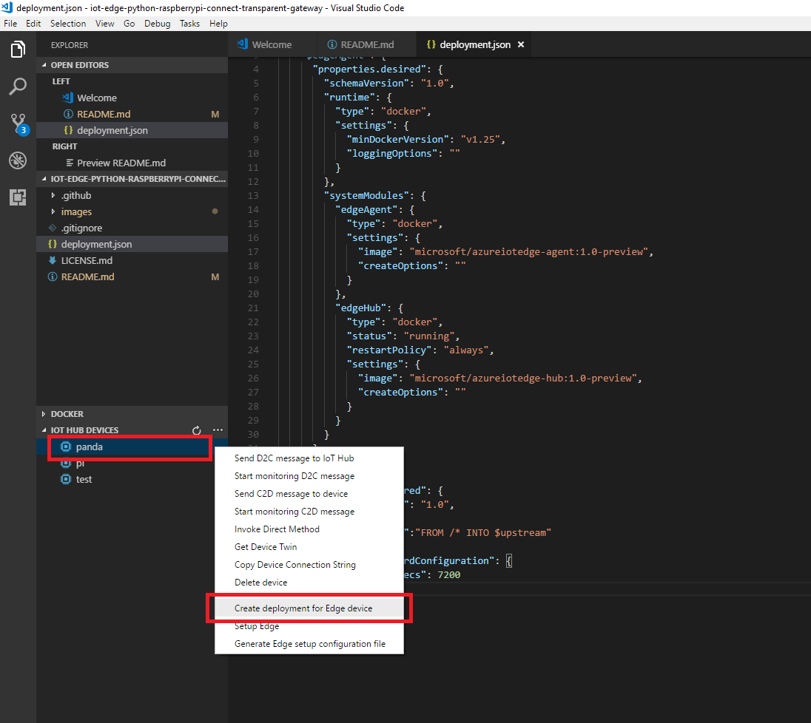

# IOT EDGE PYTHON RASPBERRYPI CONNET TRANSPARENT GATEWAY

Real world Azure Edge Hub scenario with raspberry pi as leaf node connects to edge transparent gateway.

## Step by Step Guidance

To accomplish this tutorial, user your computer or virtual machime or LattePanda(with Widnows Enterprise) as the Azure IoT Edge transparent gateway.
Mac OS support is on the way.

Use the Raspberry Pi 3 as leaf node. Prepare a temperature and humidity sensor if possible.
Make sure that your gateway and leaf node correctly setup and connect to the same network.

Follow the steps to setup your Raspbeery Pi as leaft node and your Edge Transparent Gateway.

### Gateway

- Install and start [Docker](https://www.docker.com/)
- Install [Python 2.7](https://www.python.org/downloads/) to make sure you could start the edge runtime
- Install VSCode and its extension [Azure IoT Edge](https://marketplace.visualstudio.com/items?itemName=vsciot-vscode.azure-iot-edge)

Follow the first two parts in this [document](https://docs.microsoft.com/en-us/azure/iot-edge/tutorial-simulate-device-windows) to **Create an IoT Hub** and **Register two IoT Edge devices** if you don't have any.

Create an edge device for gateway and another edge device for raspberry pi, here I name the gateway panda.

Generate all necessary certificates in gateway following this [guidance](https://docs.microsoft.com/en-us/azure/iot-edge/how-to-create-transparent-gateway).

If you has Windows 10 running in your gateway, commands could be summarized as:

```
git clone https://github.com/azure/azure-iot-sdk-c 
 
cd azure-iot-sdk-c\tools\CACertificates

Set-ExecutionPolicy -ExecutionPolicy Unrestricted

. ./ca-certs.ps1 
 
Test-CACertsPrerequisites 
 
New-CACertsCertChain 
 
New-CACertsEdgeDevice myGateway
```

Go to Azure portal Azure IoT Hub and navigate to Certificates, add a new certificate, providing the root CA file when prompted (RootCA.pem  for powershell, ./certs/azure-iot-test-only.root.ca.cert.pem in Bash) 

For the IoT Edge device, you could create the deployment and setup Edge for it with [Azure IoT Edge](https://marketplace.visualstudio.com/items?itemName=vsciot-vscode.azure-iot-edge) extension:



Start the IoT Edge runtime (Windows):
```
iotedgectl setup --connection-string {device connection string}
     --edge-hostname {gateway hostname}
     --device-ca-cert-file {full path}/certs/myGateway-public.pem
     --device-ca-chain-cert-file {full path}/certs/myGateway-all.pem
     --device-ca-private-key-file {full path}/private/myGateway-private.pem
     --owner-ca-cert-file {full path}/RootCA.pem
```
If you are wokring on Linux gateway, you could find corresponding command in document when you [generated the certificates](https://docs.microsoft.com/en-us/azure/iot-edge/how-to-create-transparent-gateway).

Check that you have two docker containers running: edgeAgent, edgeHub.

### Raspberry Pi
- Install [Raspbian] (https://docs.microsoft.com/en-us/azure/iot-hub/iot-hub-raspberry-pi-kit-python-get-started#set-up-raspberry-pi)
- *Optional*: If you have the sensor in hand, wire them up following the link above, otherwise we could just simulate the data

Plugin a real screen to you raspberry pi or just ssh it.

Generate .crt from the PEM file you generated when step the gateway. Install it to Raspberry Pi, commands for reference:
```
openssl x509 -in RootCA.pem -inform PEM -out RootCA.crt 
 
sudo cp RootCA.crt /use/local/share/ca-certificates/RootCA.crt 
 
sudo update-ca-certificates 
```

Follow the steps to clone the python sample from https://github.com/azure-samples/iot-hub-python-raspberrypi-client-app 

Follow the instructions to run setup.sh to get python sdk to work.
 
Run the app.py with device connectionstring appended with GatewayHostName, e.g.:

```python app.py "HostName=qisun-iothub.azure-devices.net;DeviceId=pi;SharedAccessKey=XXXXX;GatewayHostName=<gateway host name>"```

You could see Raspberry Pi sending messages to Edge Gateway:


Verify the gateway receives the messages with ```dockers log –f edgeHub```


Verify messages goes to iothub with VSCode extension:


>Note

If there is [ERR] Received message does not contain device id kind of error in edgeHub logs, comment those lins iot-hub-raspberry-pi-kit-python-get-started#set-up-raspberry-pi/app.py could solve it:


